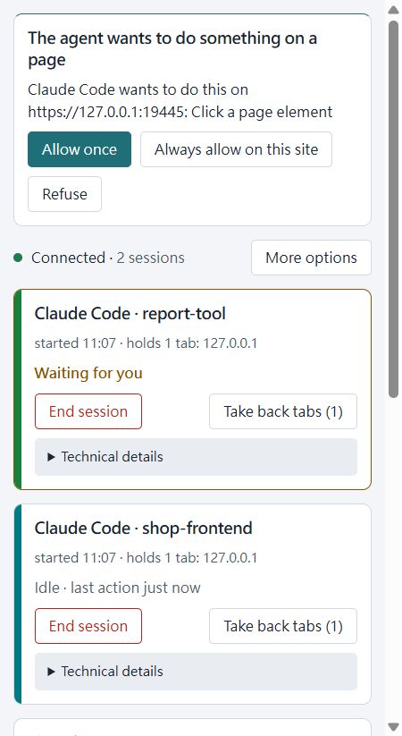

# Changelog

What each Hallpass release changed, newest first. Every release is on the
[releases page](https://github.com/norton77930/hallpass/releases) with its zip. Upgrading is
the same every time unless a section says otherwise: reinstall the host (`install.ps1` from the
zip, or `npm run agent-host:install` from source) and reload the extension.

## 0.11.0 — 2026-10-03

**Several browsers at once; you choose which one an agent uses.** Every browser (or profile) running
Hallpass is now served at the same time — no browser waits for another to close. With one browser
running nothing changes. With several, an agent's first browser tool is refused until you say which
one: three new tools (37 now) let it list the browsers (`list_browsers`), select the one you named
(`select_browser`), or ask you to pick it in the browser itself (`request_browser_choice`: every side
panel shows *"Use this browser for …?"*, and the one you confirm in is used; no answer in two minutes
ends the request). Hallpass never picks for you. The choice is remembered for the agent and used
whenever that browser is running; if it is closed, the agent is told and asks again — nothing moves to
another browser on its own. Each browser keeps its own consent: the agent pairs, and every site asks,
separately in each browser, and an approval in one never allows anything in another. The side panel
shows this browser's name — rename it there — and how many other browsers are connected.

Upgrading: reinstall the host and reload the extension in **every** browser. A browser whose extension
has not been reloaded yet is listed with a generic name ("Browser") and cannot show the in-browser
choice; a browser still talking to the host it started before the upgrade is listed as "Browser
(older Hallpass)" until it restarts. Both keep working, one browser each. The "another browser is
serving your agents" page of 0.10.0 is gone with this change.

**Also**: a click or drag on a spot nothing can be found at now tells the agent to take a screenshot
or use a reference instead of guessing coordinates; site plans unticked on a card survive another
question taking its place; internationalised site names show in your script with the plain-ASCII name
beside them; the session card only shows a site plan to the agent it was approved for.

## 0.10.0 — 2026-10-02

**An agent can ask for its sites once, up front.** A new tool, `propose_sites`, lets an agent name the
sites a task needs and say why (34 tools now). The side panel shows one card listing every site with
the purpose; you can untick sites you do not want, and the card warns that a web page can try to
steer an agent, so approve only the sites you expect for the task. Nothing is granted until you press
**Approve selected sites**; no agent argument can approve for you. The approval lets that one agent
session press, type, fill and scroll on exactly those sites (scheme, host and port) without a card
per action. It
ends when the session ends, when you unpair the agent, or when the browser closes, is never added to
your remembered site list, and the session card shows it with **Withdraw site plan** to end it at
once. Running page JavaScript, uploading files and a page moving the tab to a site you have not
decided about still ask; sites outside the list, and other sessions, behave exactly as before. This
needs the 0.10.0 extension: with an older one, the tool answers that the extension should be
reloaded, and grants nothing.

**Fixed: two browsers with Hallpass no longer knock each other out.** With Hallpass in two browsers
on one computer (Chrome and Edge, say), the two kept taking the connection from each other every
few seconds, and agent calls in either browser timed out. Now the browser that connected first keeps
serving your agents; the other one's panel says another browser is serving them, and takes over by
itself once you close the first. Both browsers need this version of the extension: with an older one
in either browser, the two still take the connection from each other.

## 0.9.0 — 2026-09-27

**The panel reads once.** The status row says the connection is up and how many sessions use it
("Connected · 2 sessions"); it no longer names an agent. The paired agents are listed under
**More options**, each with its own **Unpair**. The product name is no longer repeated as a heading
inside the panel.

**A session card says which project it is.** Each card is titled with the agent and the session's
project folder (`Claude Code · shop-frontend`), and its second line gives the start time and the
tabs it holds (without a folder the title carries the start time, and the second line does not
repeat it). The internal session id moved into **Technical details**. A card is in one of three
states: **Working** (a call is in flight), **Waiting for you** (a question from it is waiting on
you; the card is marked), or **Idle** with the time of its last action ("Idle · last action 12 min
ago"). It shows only the buttons that can act: **End session** always, at the same place;
**Interrupt this step** only while it is working; **Take back tabs (N)** only while it holds tabs.

**A site row is read once.** The permissive mode ("act without asking") is marked by a warning
border on its select, not by a second label; the diagnostics checkbox says what it allows —
"Allow reading console and network logs"; the revoke button reads just **Revoke** (screen readers
still hear the site). **Allowed upload directories** says what the list is for, says so when it is
empty and how a directory gets onto it, and shows the list file as a quiet last line.

**The tab strip tells sessions apart.** Each session's tab group is titled `Hallpass`, with `⌛`
in front while it works and `🔔` while it waits for you, in the session's own colour — the same
colour as the stripe on its panel card. Groups left over from a restart (titled `Agent` by 0.8.0
and earlier, or `Hallpass` with or without a prefix) are cleared when the extension starts.

**A keystroke that opens a dialog is answered with the dialog**, as a click that opens one is,
instead of ending as `page-not-responding`.

**Upgrading from 0.8.0:** reinstall the host (`npm run agent-host:install`, or `install.ps1` from
the zip) and reload the extension, in either order. The project name comes from the new host: with
a 0.8.0 host, a card shows the session's start time instead of the project name
(`Claude Code · started 14:02`); a 0.9.0 host with a 0.8.0 extension works as 0.8.0 did.

## 0.8.0 — 2026-09-26

**A press says what it did.** The answer to a click (and every other press, standalone or as a
batch step) now reports what followed it within the observation window: the tab went to a new
page (with the new address), it opened new tabs (each with its id and address — not held by the
session; take one with `tabs_claim`), it started downloads (named as `downloads_context` names
them), or nothing happened. When a link was pressed and nothing followed, the answer says so and
suggests reading the page or waiting before assuming the press did nothing.

**A page that does not answer is not called stale.** When a page does not answer for 10 seconds,
the call now ends as `page-not-responding` with a hint that the page is still open. If the page
stopped answering before anything was sent, the call can simply be retried; if it stopped answering
a click or keystroke that had already reached it, the hint says the input may have taken effect and
to look at the page before sending it again. `stale` is left for a page that was replaced and a tab
that is gone.

**Every finished download, once.** `wait` for a finished download answers each finished, failed or
cancelled download of the session exactly once, earliest-finished first — including ones that
finished before the wait began.

**Uploads inside a batch.** `file_upload` and `upload_image` work as `browser_batch` steps, under
the very same checks as a standalone call. Any folder question is asked before the batch runs, one
at a time in step order, and a "no" runs nothing at all. A screenshot taken inside the same batch
cannot be uploaded by that batch; upload it in a later call.

**A pairing card leaves when nobody is waiting.** When the agent behind a pairing card stops
waiting (its wait ran out, or it disconnected), the card disappears from the panel and the "!"
badge clears.

**Upgrading:** reinstall the host (`npm run agent-host:install`, or `install.ps1` from the zip) and
reload the extension, in either order. During the upgrade the host and the extension may be on
different versions: a new host names each pairing request only once the extension says it
understands that, so a 0.8.0 host with a 0.7.0 extension (or the other way round) keeps working as
0.7.0 did.

## 0.7.0

**Pairing asks only when the agent acts.** Connecting an agent no longer puts a card in the panel;
the first tool call does. When several connections of the same agent wait, the card says how many,
and marks a new one joining.

**Ignore answers at once.** Ignoring a pairing card now ends the waiting call straight away as a
refusal of that one request — the agent is told not to retry, and its next call simply asks again.
Unpairing still refuses every later call of the session, and the answer now tells the agent to
reconnect with `/mcp`.

**The panel you can see decides.** The "!" badge and the two-minute wait follow the window you are
in: a panel open in another window no longer hides a card from you or shortens the wait.

**The red edge shows where it should.** A held tab that loads or navigates (F5 included) keeps its
red edge, and so does a tab that was already open before the extension was reloaded.

**Upgrading:** reinstall the host (`npm run agent-host:install`, or `install.ps1` from the zip) —
the silent connect and the one-request Ignore live in the host. An installed 0.6.0 host keeps
refusing every later call of the session after an Ignore, as it always did.

## 0.6.0 — 2026-09-23

**Interrupt** sits beside Stop on the session card. It ends the step that is running — within a
second, whatever that step was waiting for — and keeps everything else: the pairing, the tabs and
their group, the site modes, an open recording, an emulated viewport. The agent is told you ended
the step, and whether anything had already reached the page, so it can decide for itself whether
to try it again. Stop is unchanged: it ends the session.

**A move to another site is a question.** When a tab the agent is driving leaves the site it was on
for one you have never decided about — a redirect after a click, a login provider, a shortened link
— the call that caused it says so in its answer, and the *next* call on that tab shows a card
naming both sites: **continue** (this session), **always allow** (this pair, remembered), or
**decline** (this call only; the session keeps going and the question waits for the next call).
Calls that leave are never held: a navigation elsewhere, closing the tab or handing it back go
through. Remembered pairs are listed in the panel with when each was last used, and a **Revoke**
beside each.

**A file outside your upload directories is a question too.** `file_upload` used to refuse it
outright, which meant editing `config.json` by hand before the agent could be useful. Now the local
host holds the call and the panel asks, naming every file in full and the directory each one sits
in: **this file once**, **this directory from now on** (added to your list), or **decline**. A
drive or a share root is never added to the list — those files go through as a one-call yes, and
the answer says why. The allowed directories are listed in the panel, each with a **Revoke**, and
the list is still writable only from there and from the file itself: nothing an agent can call
reads it or widens it.

And the three tails 013 left: a successful `file_upload` leaves a line on the session card the way
`upload_image` does; the `upload_image` card says which of the two deliveries you are being asked
about (a file field, or a point on the page); and `viewport` now adds a frame to a recording, so a
page that suddenly narrows on the GIF says why.

**Upgrading:** reinstall the host (`npm run agent-host:install`, or `install.ps1` from the zip) —
a 0.5.0 host refuses files outside the allowed directories with `upload-not-allowed` instead of
asking. The extension asks the host what it can do, so a 0.6.0 extension with an old host behind it
simply behaves as 0.5.0 did.

## 0.5.0

`upload_image` puts a screenshot the session just took into the page it is working on — no file on
your disk, and no writing one. Every screenshot answer now carries an `imageId`, and the agent
quotes it: to a file input by `ref` (a hidden one behind the page's own button works too), or to a
drop `coordinate` for a page that takes dragged files, one level into a same-origin frame. The
picture is held for five minutes, in the local MCP server's own memory and nowhere else, and the
upload is a page change like any other — the site's mode decides, the card says what is about to
happen, and the panel keeps one line about it afterwards. Files of your own still go through
`file_upload` and its allowed roots.

## 0.4.0

`viewport` gives one tab an emulated size — a phone, a tablet, a wide desktop — so the agent can
check a layout without touching your window; your window stays exactly where you left it, and the
two tools are independent of each other. A screenshot of an emulated tab is a picture of that
viewport, and `screenshot` takes a `scale` (0.1 to 1) for a smaller picture and crops a `region` at
the picture's own density, so the rectangle you ask for in CSS pixels is the rectangle you get. The
emulation is cleared whenever the session lets the tab go — reset, release, your take-back from the
panel, or the session ending — so no agent can leave your tab at a phone width.

## 0.3.0 — 2026-09-19

First release under the name Hallpass. Moving from 0.2.0 is described in the
[README](README.md#upgrading-from-020).
