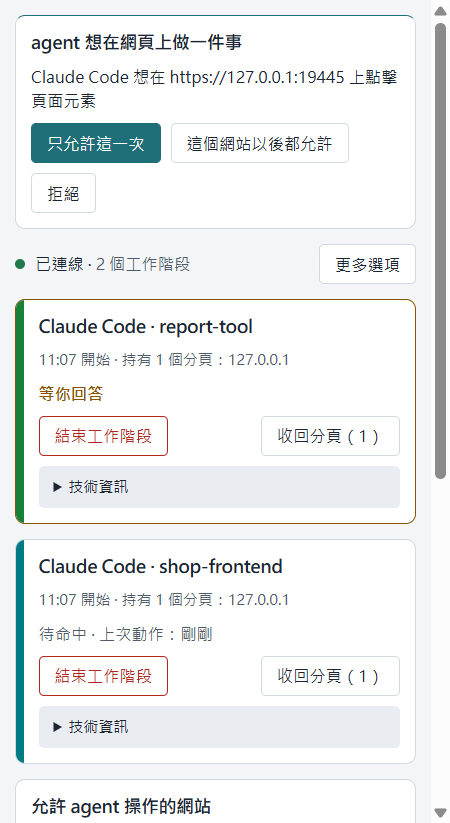

# 更新紀錄

每一版 Hallpass 改了什麼,新的在上面。英文完整版見 [CHANGELOG.md](CHANGELOG.md);安裝包在 [releases](https://github.com/norton77930/hallpass/releases)。
升級方式每一版都一樣(除非該節另有說明):重新安裝主機(zip 裡的 `install.ps1`,或從原始碼 `npm run agent-host:install`),再到 `chrome://extensions` 重新載入擴充功能。

## 0.9.0 — 2026-09-27

- **側欄一眼看得懂**：狀態列只寫連線狀態和有幾個工作階段（「● 已連線 · 2 個工作階段」），不再寫某個 agent 的名字。
  配對過的 agent 移到「更多選項」裡，每一個都有自己的「解除配對」。側欄裡也不再重複一次產品名稱當標題。
- **工作階段卡片寫出是哪個專案**：卡片標題是 agent 名稱加上專案資料夾（例如「Claude Code · shop-frontend」），
  第二行寫開始時間和持有的分頁；內部的工作階段 ID 收進「技術資訊」。卡片只會是三種狀態之一：
  「正在操作」（有呼叫在進行）、「等你回答」（它有問題在等你，卡片會標出來）、「待命中 · 上次動作：12 分鐘前」。
  按鈕只出現做得到的：「結束工作階段」一直都在、位置不變；「中斷這一步」只在正在操作時出現；
  「收回分頁（N）」只在它持有分頁時出現。
- **網站列只說一次**：「不問就直接做」這個模式改成在下拉選單加上警示色的邊框，不再多一個標籤；
  診斷授權的勾選框直接寫出允許什麼：「允許讀取 console 與網路紀錄」；撤銷按鈕只寫「撤銷」（螢幕閱讀器仍會唸出網站）。
- **分頁列分得出是哪個工作階段**：每個工作階段的分頁群組都叫 `Hallpass`，正在操作時前面加 `⌛`，
  等你回答時加 `🔔`；群組用這個工作階段自己的顏色，和它在側欄卡片左側的顏色條一樣。
  重新啟動後留下來的群組（0.8.0 以前的 `Agent`，或有沒有前綴的 `Hallpass`）會在擴充功能啟動時清掉。
- **會跳出對話框的按鍵，答案就是那個對話框**：和會跳對話框的點擊一樣，不再以 `page-not-responding` 結束。

**從 0.8.0 升級**：請重新安裝本機主機（`npm run agent-host:install`，或安裝包裡的 `install.ps1`），
再到 `chrome://extensions` 重新載入擴充功能，先後順序都可以。專案名稱是新主機送來的：
主機還是 0.8.0 時，卡片會寫開始時間而不是專案名稱（例如「Claude Code · 14:02 開始」）；
0.9.0 主機配 0.8.0 擴充功能，就照 0.8.0 的方式運作。

## 0.8.0 — 2026-09-26

- **按下去做了什麼,答案會說**:點擊(以及其他按壓動作,單獨呼叫或放在 batch 裡都一樣)的答案,
  會寫出觀察時間內接著發生了什麼:這個分頁換到新的頁面(附新網址)、開了新分頁(寫出分頁 id 與網址;
  這些分頁不屬於這個 session,要操作請用 `tabs_claim` 接手)、開始了下載(寫法和 `downloads_context` 相同),
  或什麼都沒發生。按的是連結卻什麼都沒發生時,答案會直說,並建議 agent 先讀頁面或等一下,再判斷是不是真的沒反應。
- **頁面沒回應不再被說成 stale**:頁面 10 秒沒回應時,呼叫會以 `page-not-responding` 結束,
  提示說頁面還開著。如果還沒送出任何東西,可以直接再試一次;如果是點擊或打字已經送到頁面後才沒回應,
  提示會說這個輸入可能已經生效,請先看看頁面再決定要不要重送。`stale` 只留給「頁面已經被換掉」和「分頁已經不在」這兩種情況。
- **每一個下載完成都只回報一次**:`wait` 等下載完成時,這個 session 的每一個下載(完成、失敗或取消)
  都會各回報一次,先結束的先回報;在開始等之前就已經結束的也算。
- **batch 裡也能上傳**:`file_upload` 和 `upload_image` 可以當 `browser_batch` 的步驟,檢查和單獨呼叫完全一樣。
  需要問你資料夾的,會在 batch 開始跑**之前**依步驟順序一次問一個;任何一個答「拒絕」,整個 batch 都不會執行。
  同一個 batch 裡拍的截圖不能在同一個 batch 上傳,要在下一次呼叫再上傳。
- **沒人在等的配對卡片會消失**:配對卡片背後的 agent 不再等了(等待時間到了,或它斷線了),
  卡片會從側欄移除,「!」徽章也會清掉。

**升級**:請重新安裝本機主機(`npm run agent-host:install`,或安裝包裡的 `install.ps1`),
再到 `chrome://extensions` 重新載入擴充功能,先後順序都可以。升級途中主機和擴充功能的版本可以不同:
新主機要等擴充功能表示看得懂,才會在配對請求上附上新的編號,所以 0.8.0 主機配 0.7.0 擴充功能(或反過來)
都會照 0.7.0 的方式運作。

## 0.7.0

- **配對只在 agent 真的要動手時才問**:agent 連上來不再跳卡片,要等它第一次呼叫工具才會出現。
  同一個 agent 有好幾條連線在等時,卡片會寫出有幾條,新加入的那條會標出來。
- **按「忽略」會馬上回覆 agent**:忽略配對卡片,等著的那次呼叫立刻以「拒絕這一次」結束,agent 會被告知不要重試,
  下一次呼叫就會重新問你。「解除配對」仍然會拒絕這個 session 之後的每一次呼叫,答案裡現在會提醒 agent 用 `/mcp` 重新連線。
- **以你眼前的視窗為準**:「!」徽章和兩分鐘的等待時間,跟著你目前所在的視窗走;
  別的視窗開著側欄,不會再把卡片藏起來或把等待縮短。
- **紅色邊框該出現就出現**:agent 操作中的分頁重新載入或換頁(包括按 F5)後紅框還在;
  擴充功能重新載入之前就開著的分頁也一樣。

**升級**:請重新安裝本機主機(`npm run agent-host:install`,或安裝包裡的 `install.ps1`)。
連線時不跳卡片、「忽略」只拒絕一次,這兩件事在主機裡。已安裝的 0.6.0 主機在你按「忽略」之後,
仍會像以前一樣拒絕這個 session 之後的每一次呼叫。

## 0.6.0 — 2026-09-23

- **中斷**:session 卡片上「停止」旁邊多一個「中斷」。它只結束正在跑的那一步(一秒內,不管那一步在等什麼),
  其他都留著:配對、分頁與分頁群組、網站模式、正在錄的 GIF、已套用的模擬視窗大小。agent 會知道是你中斷的,
  也會知道剛才有沒有東西已經送進頁面,自己決定要不要再試一次。「停止」的意思不變:結束整個 session。
- **跳到別的網站會先問你**:agent 操作中的分頁離開原本的網站、到了你從來沒決定過的網站時(點擊後被轉址、
  登入服務、短網址),造成這件事的那一次呼叫會在答案裡說明,而**下一次**對那個分頁的呼叫會跳出卡片,
  同時寫出兩個網站:**繼續**(這次 session)、**一律允許**(記住這一組,以後不再問)、
  **拒絕**(只拒絕這一次;session 繼續,問題留給下一次呼叫)。要離開的呼叫不會被擋:換去別的網址、
  關掉分頁、把分頁還你,都直接放行。記住的組合會列在側欄,寫著上次使用時間,旁邊有**撤銷**。
- **上傳你資料夾以外的檔案也會先問你**:`file_upload` 以前直接拒絕,等於要先手動改 `config.json`。
  現在本機主機會把這次呼叫停住,側欄完整列出每個檔案、以及每個檔案所在的資料夾,讓你選:
  **這次就好**、**這個資料夾以後都可以**(加進清單)、或**拒絕**。磁碟機或網路分享的根目錄永遠不會被加進清單,
  那些檔案只會以「這次就好」放行,答案裡會說明原因。允許的資料夾也列在側欄,各自有**撤銷**;
  這份清單仍然只有你和這個檔案本身能改,agent 呼叫得到的工具沒有任何一個讀得到或加得了。
- 另外補上 013 留下的三件小事:`file_upload` 成功後也會像 `upload_image` 一樣在 session 卡片留一行;
  `upload_image` 的同意卡片會說清楚是哪一種放法(放進檔案欄位,還是拖放到頁面上的位置);
  `viewport` 現在也會錄進 GIF,頁面突然變窄的那一格終於說得出原因。

**升級**:請重新安裝本機主機(`npm run agent-host:install`,或安裝包裡的 `install.ps1`)。
0.5.0 的主機遇到允許資料夾以外的檔案時,只會回 `upload-not-allowed` 直接拒絕,不會問你。
擴充功能會先問主機做得到什麼,所以 0.6.0 的擴充功能配上舊主機,行為就跟 0.5.0 一樣。
