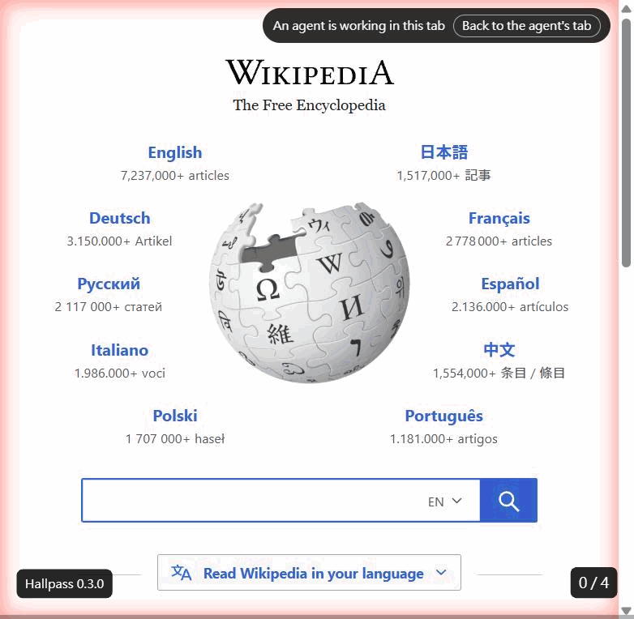

# Hallpass

**Let coding agents drive your own Chrome, one permission at a time.**

Hallpass is a Chrome extension plus a local MCP server. Claude Code, Codex CLI, Cursor, Claude
Desktop or any stdio MCP client gets 31 browser tools that work in the Chrome you already use, with
your logins. Every site the agent touches, and every action that changes a page, is gated by a
decision you make in the side panel: allow once, allow this site from now on, or refuse. You can
stop the agent at any moment and take your tabs back.

> **Platform**: Windows 11 and Google Chrome. Chromium-family browsers are registered for but
> unverified. macOS and Linux are not supported yet — see [issue #1](../../issues/1).
> **Licence**: Apache-2.0.



## How it differs

| | **Hallpass** | chrome-devtools-mcp | playwright-mcp | BrowserMCP |
| --- | --- | --- | --- | --- |
| Runs in your everyday Chrome | yes (extension) | no — a Chrome started in developer mode, separate profile | no — its own browser | yes (extension) |
| Keeps your logins | yes | no | no | yes |
| Consent per site and per action | yes — three modes, side-panel cards | no | no | not stated |
| Stop from the browser, take tabs back | yes | no | no | not stated |
| Several agents on one browser | yes — one tab group each | not stated | not stated | not stated |
| Records the run as a GIF | yes — one frame per action, labelled | no | no | no |
| Answers native dialogs | yes — accept is gated | not stated | yes | not stated |
| Platform | Windows | Windows, macOS, Linux | Windows, macOS, Linux | Windows, macOS, Linux |
| Licence | Apache-2.0 | Apache-2.0 | Apache-2.0 | MIT |

The official MCP servers give an agent *a* browser. The extension-based ones give it *your*
browser, whole. Hallpass gives it your browser with you in the loop. The design behind that is in
[docs/design-notes.md](docs/design-notes.md).

## Install

You need **Node.js 24 or newer** (`node -v`) and Chrome. Nothing runs outside your machine: the
agent talks to a local MCP server over stdio, the server talks to a relay Chrome starts, the relay
talks to the extension.

1. Download `hallpass-<version>.zip` from the [latest release](../../releases/latest) and unzip it
   into a folder you will not move later (the path is written into the registry), for example
   `D:\hallpass\`.
2. In that folder, run the installer (no administrator rights needed; it registers the native host
   under `HKCU` and writes to `%LOCALAPPDATA%\hallpass\`):
   ```powershell
   powershell -ExecutionPolicy Bypass -File .\install.ps1
   ```
3. Load the extension: open `chrome://extensions`, turn on **Developer mode**, click **Load
   unpacked**, choose the `extension\` folder from the zip. The extension is called **Hallpass** and
   its ID is `adgpccmmbgnchnphfaoabfflfcepbopd` (fixed by a key in the manifest; the native host
   accepts only this ID). Pin it to the toolbar.
4. Add the MCP server to your client. The installer prints the definition and copies it to the
   clipboard. For Claude Code:
   ```powershell
   claude mcp add hallpass --scope user -- node "D:\hallpass\host\mcp-server.js"
   ```
   For Claude Desktop, Codex CLI, Cursor and CodeBuddy the zip's `README.md` shows where each keeps
   its MCP configuration and what to paste.

**From source** instead of the zip:

```powershell
git clone https://github.com/norton77930/hallpass.git
cd hallpass
npm install
npx tsc -b
npm run build                 # apps\extension\dist\agent
npm run agent-host:install    # registers the host pointing at this checkout
claude mcp add hallpass --scope user -- node "<checkout>\packages\agent-host\dist\mcp-server.js"
```

Load `apps\extension\dist\agent` as the unpacked extension. After a rebuild, reload the extension;
the host needs no reinstall.

## First use

1. With Chrome open, tell your agent: *"Use hallpass to open https://en.wikipedia.org and tell me
   the page title."*
2. The first tool call shows a **pairing card** in the side panel (click the toolbar icon or press
   Alt+A): "Claude Code wants to connect to this browser". Allow it. You pair once; Chrome remembers.
3. The first action that **changes a page** (a click, typing, navigation) shows a **consent card**:
   "Claude Code wants to click on wikipedia.org". Choose *only this time*, *always on this site*, or
   *refuse*.
4. Tabs the agent drives sit in a tab group named **Agent**, with a glow at the page edge. The
   session appears as a card in the panel with **Stop** and **Release tabs**.

## The consent model

| Site mode | Meaning | Use it for |
| --- | --- | --- |
| **ask** (default) | Every page-changing action shows a consent card | Sites you do not know, sites with an account |
| **follow-a-plan** | A multi-step `browser_batch` is approved once as a plan (you can strike steps); single actions still ask | Fixed flows such as filling a form |
| **skip-checks** | Nothing is asked on this site; marked with a warning in the list | Sites you trust with no sensitive data |

- **Reads never ask.** Reading the page, finding elements, screenshots and waiting need no consent.
- **Diagnostics** (console, network records, evaluating script) need a separate per-site grant you
  tick in the panel. Evaluating script also counts as an action.
- **Uploads** are limited to directories you list in `%LOCALAPPDATA%\hallpass\config.json` under
  `uploadRoots` (empty by default, so no uploads until you add one).
- **Downloads** land in Chrome's download folder as usual; the agent is told the name and state and
  never starts, opens, moves or deletes one.
- **Form values** are readable except password, hidden, one-time-code and payment-card fields,
  which are reported as redacted.
- **Dialogs**: cancelling and acknowledging an alert never ask; pressing OK is gated like a click,
  except when it follows an action you just approved. Dialog text is logged on the session card.
- **Stop** ends the session and tells the agent you stopped it. **Release tabs** hands every tab
  back to you while the session continues.

Sensitive sites — banking, health, anything you would not hand to a stranger — do not belong in
`skip-checks`. The agent uses your profile and sees what you see.

## Tools

The agent sees these as `mcp__hallpass__<name>` in Claude Code.

| Tool | What it does |
| --- | --- |
| `tabs_context` | List every tab in the browser and who holds each one |
| `tabs_create` / `tabs_close` | Open a tab in the session's group; close one it owns |
| `tabs_claim` / `tabs_release` | Take one of your tabs into the session; give it back |
| `navigate` | Go to a URL or back/forward; stays on the page if it asks to (`force` to leave) |
| `resize_window` | Resize the window holding a tab; restored when the session lets go |
| `read_page` / `get_page_text` / `find` | Structure with refs and field values; visible text; elements by description |
| `screenshot` | PNG of a tab, optionally cropped |
| `click` / `right_click` / `double_click` / `triple_click` / `hover` / `drag` | Pointer actions delivered as real input |
| `type` / `key` / `scroll` / `form_input` | Keyboard, scrolling and form controls |
| `computer` | Act at a viewport point when the page's structure does not describe the target |
| `browser_batch` | Several steps on one tab in one call, approved once under follow-a-plan |
| `wait` | Fixed time, a page condition, or the next download to finish |
| `downloads_context` | The downloads this session caused, with paths and states |
| `read_console` / `read_network` / `evaluate` | Diagnostics, behind the per-site grant |
| `file_upload` | Put your files (from allowed roots) into a file input |
| `gif_recorder` | Start, stop, export or clear a recording of the session |
| `dialog` | Accept or dismiss an alert, confirm or prompt |

## Testing

```powershell
npm run typecheck
npm test                 # unit + panel tests
npm run test:contract    # contract tests on the built artifacts
```

These three run in CI on Windows. Two more suites need a real Chrome and run locally before a
release: the packaged gate (`tests/e2e/packaged/agent-*.spec.ts`, attaching to a Chrome started
with `--remote-debugging-port=9222`) and the acceptance probes, which drive the bridge with a real
coding-agent session. [CONTRIBUTING.md](CONTRIBUTING.md) explains how to run both.

## Upgrading from 0.2.0

0.3.0 renames the product: the MCP server is `hallpass` (was `poc-browser`), the host is
`com.hallpass.host` in `%LOCALAPPDATA%\hallpass\` (was `poc-agent-host`). Your pairing and site
modes are kept — they are stored under the extension's unchanged ID. Steps:

1. Unzip 0.3.0 into a folder and run its `install.ps1`. It removes the old host registration and
   tells you; delete `%LOCALAPPDATA%\poc-agent-host\` yourself when you are done.
2. Re-enter your upload roots in the new `config.json` if you had any.
3. Reload the extension from the new `extension\` folder (`chrome://extensions` → Load unpacked).
4. Re-register the server: `claude mcp remove poc-browser --scope user`, then the `claude mcp add
   hallpass …` line the installer printed.

## Contributing

Issues and pull requests are welcome. Read [CONTRIBUTING.md](CONTRIBUTING.md) for the build, the
test suites, the two-attempts rule and the clean-room boundary, and [SECURITY.md](SECURITY.md) for
reporting a vulnerability privately. The specifications behind every feature are under
[specs/](specs/).

## Licence

[Apache-2.0](LICENSE). Third-party components are listed in
[THIRD_PARTY_NOTICES.md](THIRD_PARTY_NOTICES.md).
